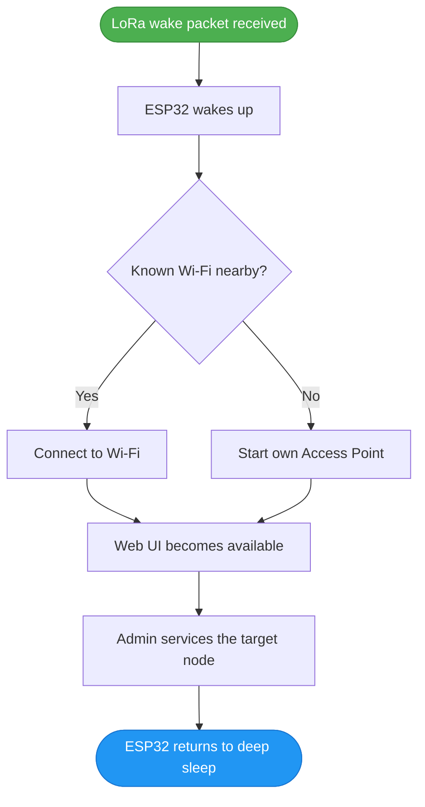

<div align="center">

# 🛰️ ESP-OOB-Supervisor

**Low-power controller for remote maintenance of LoRa / Meshtastic nodes.**

[](#-status)
[](LICENSE)
[](#-hardware-architecture-and-wiring)

</div>

Normally, the ESP32 supervisor is in **deep sleep**. Upon receiving a valid **LoRa wake packet**, it wakes up, connects to Wi-Fi (or starts its own Access Point), and opens a local Web UI for maintenance operations.

---

## 🎯 Purpose

Remote LoRa nodes are often installed in hard-to-reach places:
* 🗼 Poles and masts
* 🏠 Building roofs
* 🌳 Trees
* ⛰️ Remote outdoor locations

Physical access to them is difficult or time-consuming. **ESP-OOB-Supervisor** allows the administrator to wake up, configure, reboot, and flash the target node without the need to physically dismount it.

---

## ⚙️ Main Features

| Feature | Description |
|---|---|
| 💤 **Deep Sleep** | Most of the time, the ESP32 sleeps to save energy. |
| 📡 **LoRa Wake-up** | Wakes up only after receiving a valid LoRa packet. |
| 🔑 **Wake Key** | Simple protection against random or malicious wake packets. |
| 📶 **Wi-Fi Client** | Connects to the last known Wi-Fi network. |
| 📲 **Access Point** | Creates its own AP if an external network is unavailable. |
| 🌐 **Web UI** | Local web interface for direct management. |
| 🔌 **UART Access** | Serial access to the target node. |
| 🔁 **Hardware Reset** | Direct control of the Reset / EN pin. |
| 🧷 **Bootloader Mode**| BOOT pin control for flashing the target device. |
| ⬆️ **Firmware Upload**| Manual firmware upload (OTA) via Web UI. |
| ☁️ **Auto Download** | Optional firmware downloading from an update server. |
| ⏱️ **Auto Sleep**| Automatic return to sleep mode upon timeout. |

---

## 🔄 Basic Workflow



---

## 🔐 Wake Security

The Wake Key is configured in the ESP32 Web UI. 

**Example wake packet:**
```json
{
  "type": "wake",
  "device_id": "node-mast-01",
  "wake_key": "my-long-service-key",
  "action": "maintenance"
}
```
> **Note:** If `device_id` and `wake_key` match, the supervisor starts maintenance mode. If they do not match, the packet is ignored, and the ESP32 immediately returns to sleep mode.

---

## 📶 Maintenance Modes

### 1. Wi-Fi Client Mode
After waking up, the ESP32 attempts to connect to the last known Wi-Fi network. Examples:
- Administrator's phone hotspot
- Home or base Wi-Fi network
- Portable service router
- Temporary field network

### 2. Access Point Mode
If none of the known Wi-Fi networks are available, the ESP32 switches to fallback mode and creates its own Access Point.

```text
SSID: ESP-OOB-node-mast-01
IP:   192.168.4.1
```
The administrator connects directly to this network and opens the Web UI.

---

## 🖥️ Web UI

The local web interface provides a fully functional control panel:
* ESP32 and target node status
* Wi-Fi and LoRa wake settings
* Wake Key configuration
* **UART Terminal**
* Reset button and Bootloader mode switch
* Target node flashing and download settings
* Sleep / reboot management

---

## ⬆️ Firmware Update Methods

ESP-OOB-Supervisor can update the firmware of the target LoRa node in two ways:

1. **Manual Upload:** `Phone / Laptop` → `ESP32 Web UI` → `firmware.bin` → `Target Node`
2. **Auto Download:** ESP32 connects to Wi-Fi and automatically downloads firmware from a specified update server.

**Recommended default settings for auto-download:**
* Auto-download: `Enabled`
* Auto-flash: `Disabled`
* Manual confirmation before flashing: `Enabled`

---

## 📂 Project Structure

```text
ESP-OOB-Supervisor/
├── README.md
├── README.ru.md
│
├── docs/
│   ├── architecture.md
│   ├── wiring.md
│   ├── lora-wake.md
│   ├── flashing.md
│   └── power-saving.md
│
├── firmware/
│   ├── platformio.ini
│   ├── include/
│   │   ├── Config.h, Pins.h, WakeConfig.h, TargetConfig.h
│   │
│   └── src/
│       ├── main.cpp
│       ├── sleep_manager.cpp, lora_wake.cpp, wifi_manager.cpp
│       ├── web_ui.cpp, target_uart.cpp, target_flasher.cpp
│       └── firmware_downloader.cpp, config_store.cpp
│
├── server/
│   └── update-server/
│       ├── manifest.json
│       └── firmware/
│
└── tools/
    ├── send_wake_packet.py
    ├── build_manifest.py
    └── flash_test.py
```

---

## 🧪 Development Stages (Roadmap)

- [x] Stage 1: Deep sleep + LoRa wake-up
- [x] Stage 2: Wake Key verification
- [x] Stage 3: Wi-Fi reconnect + fallback AP
- [x] Stage 4: Local Web UI
- [ ] Stage 5: UART terminal
- [ ] Stage 6: Reset / BOOT pin control
- [ ] Stage 7: Manual firmware upload
- [ ] Stage 8: Auto firmware download
- [ ] Stage 9: Target node flashing process
- [ ] Stage 10: Power consumption optimization

---

## 🚧 Status

**Early development.**

---

## 📄 License

This project is licensed under the [MIT License](LICENSE).    C -- No --> E[Start internal Access Point]
    D --> F[Web UI becomes available]
    E --> F
    F --> G[Admin services the target node]
    G --> H([ESP32 returns to deep sleep])
    
    style A fill:#4CAF50,stroke:#388E3C,color:white
    style H fill:#2196F3,stroke:#1976D2,color:white
