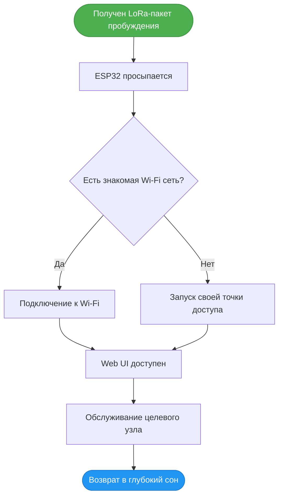
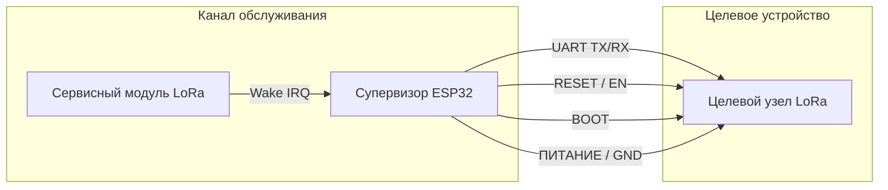

# 🛰️ ESP-OOB-Supervisor

**Контроллер для удаленного обслуживания узлов LoRa / Meshtastic.**

Супервизор ESP32 находится в глубоком сне. При получении валидного **LoRa-пакета** он просыпается, подключается к Wi-Fi (или создает свою точку доступа) и открывает Web UI для удаленной прошивки, сброса и настройки целевого узла.

---

## 🔄 Принцип работы

---

## 🧩 Аппаратная архитектура

**Обязательное подключение пинов:**
* `ESP32 TX` ➔ `Target RX`
* `ESP32 RX` ➔ `Target TX`
* `ESP32 GPIO` ➔ `Target RESET / EN`
* `ESP32 GPIO` ➔ `Target BOOT`
* `GND` ➔ `GND`

---

**Лицензия:** [MIT](LICENSE)    C -- Нет --> E[Запуск собственной точки доступа]
    D --> F[Web UI становится доступен]
    E --> F
    F --> G[Администратор обслуживает целевой узел]
    G --> H([ESP32 возвращается в глубокий сон])
    
    style A fill:#4CAF50,stroke:#388E3C,color:white
    style H fill:#2196F3,stroke:#1976D2,color:white
