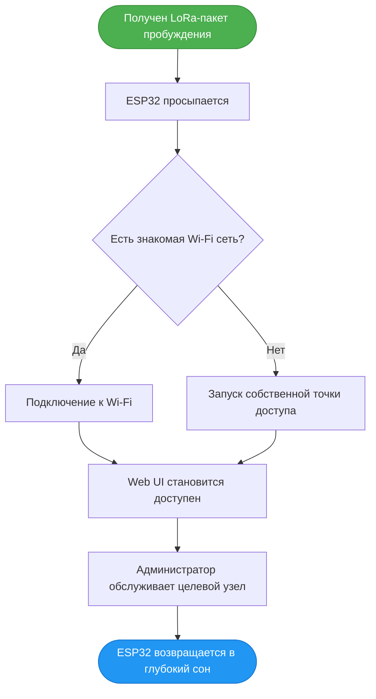

<div align="center">

# 🛰️ ESP-OOB-Supervisor

**Контроллер с низким энергопотреблением для удаленного обслуживания узлов LoRa / Meshtastic.**

[](#-статус)
[](LICENSE)
[](#-аппаратная-архитектура-и-подключение)

</div>

В обычном режиме супервизор ESP32 находится в **глубоком сне (deep sleep)**. При получении валидного **LoRa-пакета пробуждения** он просыпается, подключается к Wi-Fi (или запускает собственную точку доступа) и открывает локальный Web UI для проведения сервисного обслуживания.

---

## 🎯 Назначение

Удаленные узлы LoRa часто устанавливаются в труднодоступных местах:
* 🗼 Столбы и мачты
* 🏠 Крыши зданий
* 🌳 Деревья
* ⛰️ Удаленные точки на открытой местности

Физический доступ к ним затруднен или занимает много времени. **ESP-OOB-Supervisor** позволяет администратору пробуждать, настраивать, перезагружать и прошивать целевой узел без необходимости его физического демонтажа.

---

## ⚙️ Основные возможности

| Функция | Описание |
|---|---|
| 💤 **Глубокий сон** | Большую часть времени ESP32 спит для экономии энергии. |
| 📡 **LoRa-пробуждение** | Просыпается только после получения правильного пакета LoRa. |
| 🔑 **Ключ пробуждения** | Простая защита от случайных или вредоносных пакетов пробуждения. |
| 📶 **Wi-Fi Клиент** | Подключается к последней известной сети Wi-Fi. |
| 📲 **Точка доступа** | Создает собственную AP, если внешняя сеть недоступна. |
| 🌐 **Web UI** | Локальный веб-интерфейс для прямого управления. |
| 🔌 **Доступ по UART** | Последовательный доступ к целевому узлу. |
| 🔁 **Аппаратный сброс** | Прямое управление пином Reset / EN. |
| 🧷 **Режим загрузчика**| Управление пином BOOT для прошивки целевого устройства. |
| ⬆️ **Загрузка прошивки**| Ручная загрузка прошивки (OTA) через Web UI. |
| ☁️ **Автоскачивание** | Опциональное скачивание прошивки с сервера обновлений. |
| ⏱️ **Автоматический сон**| Автоматический возврат в спящий режим по таймауту. |

---

## 🔄 Базовый процесс (Workflow)



---

## 🔐 Безопасность пробуждения

Ключ пробуждения (Wake Key) настраивается в Web UI ESP32. 

**Пример пакета пробуждения:**
```json
{
  "type": "wake",
  "device_id": "node-mast-01",
  "wake_key": "my-long-service-key",
  "action": "maintenance"
}
```
> **Примечание:** Если `device_id` и `wake_key` совпадают, супервизор запускает режим обслуживания. Если они не совпадают, пакет игнорируется, и ESP32 немедленно возвращается в спящий режим.

---

## 📶 Режимы обслуживания

### 1. Режим Wi-Fi клиента
После пробуждения ESP32 пытается подключиться к последней известной сети Wi-Fi. Примеры:
- Точка доступа на телефоне администратора
- Домашняя или базовая сеть Wi-Fi
- Сервисный портативный роутер
- Временная полевая сеть

### 2. Режим точки доступа (Access Point)
Если ни одна из известных Wi-Fi сетей недоступна, ESP32 переходит в режим резервирования и создает собственную точку доступа.

```text
SSID: ESP-OOB-node-mast-01
IP:   192.168.4.1
```
Администратор подключается напрямую к этой сети и открывает Web UI.

---

## 🖥️ Web UI

Локальный веб-интерфейс предоставляет полнофункциональную панель управления:
* Статус ESP32 и целевого узла
* Настройки Wi-Fi и пробуждения по LoRa
* Настройка ключа пробуждения (Wake Key)
* **Терминал UART**
* Кнопка сброса (Reset) и переключение в режим загрузчика (Bootloader)
* Прошивка целевого узла и настройки скачивания
* Управление сном / перезагрузкой

---

## ⬆️ Методы обновления прошивки

ESP-OOB-Supervisor может обновлять прошивку целевого узла LoRa двумя способами:

1. **Ручная загрузка:** `Телефон / Ноутбук` → `Web UI ESP32` → `firmware.bin` → `Целевой узел`
2. **Автоматическое скачивание:** ESP32 подключается к Wi-Fi и самостоятельно скачивает прошивку с заданного сервера обновлений.

**Рекомендуемые параметры по умолчанию для автоскачивания:**
* Автоскачивание: `Включено`
* Автопрошивка: `Отключено`
* Ручное подтверждение перед прошивкой: `Включено`

---

## 📂 Структура проекта

```text
ESP-OOB-Supervisor/
├── README.md
├── README.ru.md
│
├── docs/
│   ├── architecture.md
│   ├── wiring.md
│   ├── lora-wake.md
│   ├── flashing.md
│   └── power-saving.md
│
├── firmware/
│   ├── platformio.ini
│   ├── include/
│   │   ├── Config.h, Pins.h, WakeConfig.h, TargetConfig.h
│   │
│   └── src/
│       ├── main.cpp
│       ├── sleep_manager.cpp, lora_wake.cpp, wifi_manager.cpp
│       ├── web_ui.cpp, target_uart.cpp, target_flasher.cpp
│       └── firmware_downloader.cpp, config_store.cpp
│
├── server/
│   └── update-server/
│       ├── manifest.json
│       └── firmware/
│
└── tools/
    ├── send_wake_packet.py
    ├── build_manifest.py
    └── flash_test.py
```

---

## 🧪 Этапы разработки (Roadmap)

- [x] Этап 1: Глубокий сон + LoRa-пробуждение
- [x] Этап 2: Проверка ключа пробуждения (Wake Key)
- [x] Этап 3: Переподключение к Wi-Fi + резервная точка доступа
- [x] Этап 4: Локальный Web UI
- [ ] Этап 5: Терминал UART
- [ ] Этап 6: Управление пинами Reset / BOOT
- [ ] Этап 7: Ручная загрузка прошивки
- [ ] Этап 8: Автоматическое скачивание прошивки
- [ ] Этап 9: Процесс прошивки целевого узла
- [ ] Этап 10: Оптимизация энергопотребления

---

## 🚧 Статус

**Ранняя разработка.** Текущий фокус: LoRa-пробуждение, глубокий сон, локальный Web UI и работа над прошивкой целевого узла.

---

## 📄 Лицензия

Этот проект распространяется под лицензией [MIT](LICENSE).* `GND` ➔ `GND`

---
